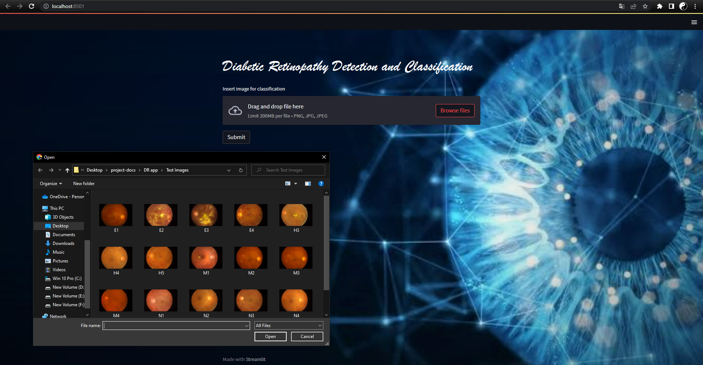

# Detection and Classification of Diabetic Retinopathy using Hybrid Models
We created a website, where the user can able to upload their fundus images to find whether they have diabetic retinopathy or not. If they have diabetic retinopathy, it will also display what type of diabetic retinopathy it is.


We took the dataset from Kaggle to train and test the models


## Project Demo
[Demo video link 🎥](https://youtu.be/JKR0SVPFDWA)
## Team Members
- [@bharghavi](https://github.com)
- [@mathumita](https://github.com/Mathumita)
- [@deepthi308](https://github.com/deepthi308)


## Our Base Paper

[Hybrid Retinal Image Enhancement Algorithm for Diabetic Retinopathy Diagnostic Using Deep Learning Model](https://ieeexplore.ieee.org/stamp/stamp.jsp?tp=&arnumber=9819926)


## Here we have used two models

#### One for Detection

```http
Whether a person have DR or not
```
#### One for Classification

```http
What type of Diabetic Retinopathy it is
```


## Output Images





## Deployment

To excute this project on web browser

```bash
  streamlit run app.py
```


